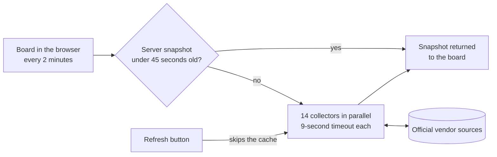

<h1 align="center">Status Bar</h1>

<p align="center"><strong>Official sources. One board.</strong></p>

<p align="center">
  Live status for the cloud, gaming, platform and AI services people actually wait on,<br>
  read straight from each vendor and never from rumor.
</p>

<p align="center">
  <a href="https://github.com/greenblacked/status-page/actions/workflows/ci.yml"></a>
  <a href="https://github.com/greenblacked/status-page/actions/workflows/codeql.yml"></a>
</p>

<p align="center">
  <a href="#quick-start">Quick start</a> ·
  <a href="#what-it-watches">What it watches</a> ·
  <a href="#how-it-decides">How it decides</a> ·
  <a href="#faq">FAQ</a> ·
  <a href="#development">Development</a>
</p>

## Why Status Bar

When something breaks, the answer is spread across a dozen vendor dashboards, each with its own layout and vocabulary. Outage trackers are quicker, but they count user complaints, not what the vendor has confirmed. Status Bar puts the official answers on one screen and holds itself to four rules:

- **Official or nothing.** Every signal comes from the vendor's own status page, feed or public API. No crowd reports, no unofficial aggregators.
- **Unknown beats a guess.** If a source times out or changes its format, its card says Unknown and why. Missing data never turns into an all clear.
- **Zero setup.** No API keys, no accounts, no environment variables.
- **The vendor has the last word.** Every card links to the vendor's own page, which stays the source of truth.

## What it watches

🟢 Operational · 🔧 Maintenance · 🟡 Degraded · 🔴 Outage · ❔ Unknown

Fourteen services, each read from one official source. This table is the contract: if a source is not listed here, Status Bar does not read it.

| Group | Service | Official source |
| --- | --- | --- |
| Cloud | Google Cloud | [status.cloud.google.com](https://status.cloud.google.com/) |
| Cloud | AWS | [AWS Health Dashboard](https://health.aws.amazon.com/health/status) |
| Gaming | Steam | [Steam Web API](https://api.steampowered.com/) and Store |
| Gaming | CS2 Europe | Valve SDR config for app `730`, plus the live player count |
| Gaming | Epic Games | [status.epicgames.com](https://status.epicgames.com/) |
| Gaming | Fortnite | [status.epicgames.com](https://status.epicgames.com/), Fortnite components only |
| Platforms | Spotify | [spotify.statuspage.io](https://spotify.statuspage.io/) |
| Platforms | Apple | [Apple System Status](https://www.apple.com/support/systemstatus/) |
| Platforms | Android / Google Play | [Play Status](https://status.play.google.com/summary) |
| AI | Grok | [status.x.ai](https://status.x.ai/) |
| AI | ChatGPT | [status.openai.com](https://status.openai.com/) |
| AI | Claude | [status.claude.com](https://status.claude.com/) |
| Updates | MikroTik RouterOS | [MikroTik changelogs](https://mikrotik.com/download/changelogs) |
| Updates | Apple OS | [Apple Developer Releases](https://developer.apple.com/news/releases/) |

## How it decides

Each vendor speaks its own dialect. Status Bar translates all of them into five states:

| State | Meaning |
| --- | --- |
| 🟢 Operational | The vendor reports no active incident |
| 🔧 Maintenance | Scheduled work is in progress |
| 🟡 Degraded | Partial impact, elevated errors, or thin coverage |
| 🔴 Outage | Major or critical impact |
| ❔ Unknown | The source timed out, returned an error, or sent data Status Bar could not read |

The overall card shows the worst state on the board: **All clear** when everything is Operational, **Outage** if anything is out, and **Attention** for everything in between.

The two Updates services track releases, not incidents. They stay Operational and highlight any channel or OS released in the last 14 days.

<details>
<summary><strong>The rule behind every card</strong></summary>

<br>

| Service | How it is read |
| --- | --- |
| Google Cloud | `incidents.json`; only incidents without an end time count |
| AWS | Public current events. An event counts while it is unresolved and updated within the last 14 days. Single-region or single-zone events are Degraded, not Outage |
| Steam | `GetServerInfo` plus the Store featured API. Both answering with the expected data is Operational, only one is Degraded and its component says why. If neither can be read, the card is Unknown |
| CS2 Europe | European relay points of presence. Outage when the relay config reports failure or lists no European points. Degraded when fewer than 3, or fewer than 40%, of them publish relays. An Operational card shows the player count when it is available; the count never affects health |
| Epic Games | Statuspage summary, worst component, excluding Fortnite components |
| Fortnite | Same page, only components whose name contains "Fortnite" |
| Spotify, ChatGPT, Claude | Statuspage summary indicator |
| Apple | `system_status_en_US.js`, services with an active event |
| Android / Google Play | Play `incidents.json`; only incidents without an end time count |
| Grok | RSS `feed.xml`. An item counts when it is not resolved and was published within the last 14 days |
| MikroTik RouterOS | The official `NEWEST*` files for RouterOS 7 stable, long-term, testing and development and RouterOS 6 long-term, plus the newest version's `CHANGELOG` |
| Apple OS | Releases RSS, latest version of iOS, iPadOS, macOS, watchOS, tvOS and visionOS |

</details>

### From vendor to board



Collection runs on the server, so the browser never deals with vendor CORS and every open board shares one cached snapshot. Each collector fails on its own: one broken source costs one card, never the board.

## Quick start

You need Node 22.13.0 (pinned in `.nvmrc`), npm 11.9.0, and outbound HTTPS to the vendors above.

```bash
git clone https://github.com/greenblacked/status-page.git
cd status-page
nvm use
npm ci
npm run dev
```

Open the local URL that Vite prints. The first load reads all fourteen sources, which can take a few seconds.

**On the board:**

- Filter by Cloud, Gaming, Platforms, AI or Updates, search by name, or switch on **Issues only**
- Watch the countdown: the board pulls a new snapshot every two minutes
- Read the **Board log** to see what changed between two-minute slots
- Press **Refresh** to skip the cache and ask every vendor right now. Presses within 15 seconds of the last check reuse it
- Open any card's vendor page for the full story

## Integrations

The board publishes what it shows in three open formats. All three come from the same two-minute snapshot as the page, allow cross-origin reads, and are cached for a minute.

| Endpoint | Format | Use it for |
| --- | --- | --- |
| `/api/status.json` | JSON: overall health, headline, counts, and each service's health, summary, source and incidents | Scripts, dashboards, chat bots |
| `/feed.xml` | Atom, one entry per service that needs attention | Alerts in Slack, Teams, Discord or a feed reader |
| `/api/badge/<service>` | [Shields.io endpoint badge](https://shields.io/badges/endpoint-badge) | A live status badge in a README or wiki |

**Alerts without code.** Subscribe a chat tool to the feed:

- Slack: `/feed subscribe https://<your-host>/feed.xml`
- Microsoft Teams: the RSS connector, pointed at the same URL
- Discord: any RSS feed bot

An entry's id includes the service's health and a fingerprint of its summary, so a feed reader posts again when an incident gets worse, better or reworded, and stays quiet otherwise.

**Badges.** Use a service id, or `board` for the whole board:

```markdown


```

Service ids: `gcp`, `aws`, `steam`, `cs2-europe`, `epic`, `fortnite`, `spotify`, `apple`, `android`, `grok`, `chatgpt`, `claude`, `mikrotik`, `apple-os`. An unknown id returns a grey "unknown service" badge instead of an error.

Shields.io fetches the badge from your host, so badges need a public deployment.

**Quick check:**

```bash
curl -s http://localhost:3000/api/status.json | jq '.overall, .headline'
curl -s http://localhost:3000/feed.xml | head -20
curl -s http://localhost:3000/api/badge/gcp
```

## FAQ

<details>
<summary><strong>Every card says Unknown. What is wrong?</strong></summary>

<br>

The server cannot reach the vendors. The collectors run on the machine that serves the board, so check its outbound HTTPS, proxy and firewall settings.

</details>

<details>
<summary><strong>One card says Unknown. Is the vendor down?</strong></summary>

<br>

Not necessarily. Unknown means Status Bar could not read that vendor's source: it timed out, returned an error, or changed its format. The card shows the reason, and the server logs one `collector_failed` JSON line with the service, the kind of failure and the vendor host. An hourly job in this repository calls every source and opens an issue when one stays unreadable.

</details>

<details>
<summary><strong>How fresh is the data?</strong></summary>

<br>

Usually under three minutes old. Each board asks the server every two minutes, and the server reuses a snapshot for up to 45 seconds so that many open boards share one set of vendor requests. **Refresh** skips the cache and asks every vendor at once, unless the last check was under 15 seconds ago.

Opening the page never waits on the slowest vendor: if the cached snapshot expired within the last 75 seconds, the page renders from it, the server collects a new one behind it, and the board fetches that one straight away.

</details>

<details>
<summary><strong>Why only Europe for CS2?</strong></summary>

<br>

Valve's game-server status API needs an API key, and Status Bar uses none. The public, official signals are Valve's Steam Datagram Relay config and the live player count, and the board reads the European relay network from them. Other regions are not collected.

</details>

<details>
<summary><strong>Why does Grok come from an RSS feed?</strong></summary>

<br>

The status page's JSON API sits behind a Cloudflare challenge, so the official RSS feed is the readable source. It carries the whole incident history, which is why only items from the last 14 days count.

</details>

<details>
<summary><strong>Does Status Bar store anything?</strong></summary>

<br>

The server holds only the latest snapshot, in memory, and reuses it for up to 45 seconds. Nothing is written to disk or a database. The Board log lives in your browser's local storage and keeps the last two hours. Private windows or blocked site data leave it empty.

</details>

<details>
<summary><strong>Is there a hosted version?</strong></summary>

<br>

Not yet. `npm run build` produces a Fetch-style server handler in `dist/server/server.js`, and the repository deliberately does not pick a hosting adapter. `npm run preview` is a smoke test of that build, not a production host.

</details>

## Development

React 19 on TanStack Start, Tailwind v4, Vitest, TypeScript in strict mode.

| Command | What it does |
| --- | --- |
| `npm run dev` | Development server with hot reload |
| `npm run typecheck` | Type-check without emitting |
| `npm test` | Unit tests, fully offline |
| `npm run build` | Production build into `dist/` |
| `npm run preview` | Serve the build for a smoke test |

```text
src/lib/status/           # catalog, health model, collectors, cache and schedule
src/components/status/    # board UI
src/routes/               # TanStack Start routes
scripts/ci/               # checks that CI and contributors run the same way
scripts/release/          # version bump for a release
.github/workflows/        # CI, security scans, and the triage and source-health bots
docs/                     # commit and README conventions
```

The repository checks need no install, and CI runs the same commands:

```bash
./scripts/ci/hygiene.sh                   # line endings, whitespace, no `any`, no raw hex in JSX
./scripts/ci/links.sh                     # relative links in the Markdown docs
./scripts/ci/commits.sh origin/main..HEAD # Conventional Commits
./scripts/ci/release-notes.sh             # the CHANGELOG.md section the next release publishes
node --experimental-strip-types scripts/ci/source-health.ts   # the one check that calls real vendors
```

**In the shared CI images.** [`compose.yaml`](compose.yaml) runs the same checks inside the public images from [greenblacked/github-base-images](https://github.com/greenblacked/github-base-images), so a failure can be reproduced with the exact toolchain a container job uses. Only Docker is needed, no local Node:

```bash
docker compose run --rm node22         # ci-node22: npm ci, typecheck, tests, build, repository checks
docker compose run --rm node24         # the same on ci-node24
docker compose up preview              # ci-node22: serve the built board on http://127.0.0.1:4173
docker compose run --rm security       # ci-security: trivy (HIGH/CRITICAL) and gitleaks
```

`node_modules` and `dist` stay inside Docker volumes, so the Linux install never overwrites a macOS or Windows one. The images follow the latest release of each Node line, while `.nvmrc` pins 22.13.0 for CI's `verify` job, so this is a check on the line rather than an exact replay of that job. The tags are rolling; set `CI_NODE22_IMAGE`, `CI_NODE24_IMAGE` or `CI_SECURITY_IMAGE` to an `@sha256:` digest to pin one. `docker compose down --volumes` removes the cached installs.

Every pull request runs CI on the pinned Node and on Node 24, plus CodeQL and dependency review. A triage bot explains failed checks in one PR comment, and the hourly source-health job watches the real endpoints. [.github/workflows/README.md](.github/workflows/README.md) covers each workflow.

**Releases:** run the Release workflow with bump `patch`, `minor` or `major` (`gh workflow run release.yml -f bump=minor`). CI bumps the version, tags the commit and publishes a GitHub Release, with notes taken from [CHANGELOG.md](CHANGELOG.md). [CONTRIBUTING.md](CONTRIBUTING.md#releases) has the details.

**Adding a service:** add a catalog entry in `src/lib/status/catalog.ts` and a collector in `src/lib/status/sources.server.ts`, read only an official machine-readable source, map it onto the five states, and add it to [What it watches](#what-it-watches) in the same commit. [CONTRIBUTING.md](CONTRIBUTING.md#adding-a-service) has the full checklist.

## Security

Report vulnerabilities privately, as described in [SECURITY.md](SECURITY.md). Please do not open a public issue.

## Disclaimer and license

Status Bar is not affiliated with Google, Amazon, Valve, Epic Games, Spotify, Apple, MikroTik, xAI, OpenAI, or Anthropic. Names and marks belong to their owners.

Released under the MIT License. See [LICENSE](LICENSE).

## Contributing

Commits follow Conventional Commits and are authored by the GitHub account that pushes them. Read [CONTRIBUTING.md](CONTRIBUTING.md) and [docs/git-and-readme.md](docs/git-and-readme.md) before opening a pull request.
