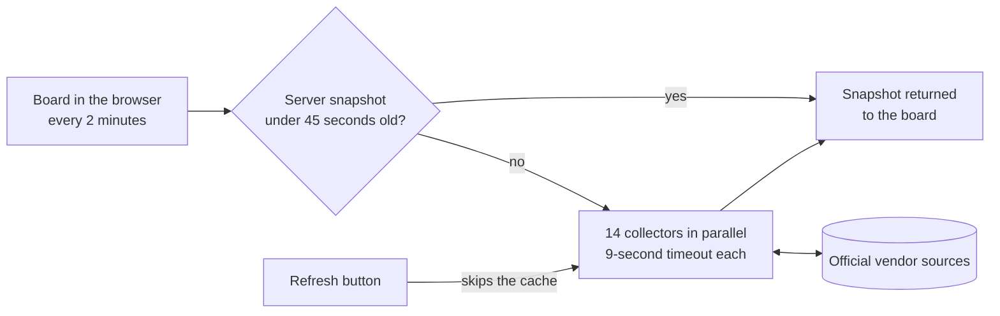

# AllClear

[](https://github.com/greenblacked/status-page/actions/workflows/ci.yml)
[](https://github.com/greenblacked/status-page/actions/workflows/codeql.yml)

A live status board for cloud, gaming, platform and AI services, built only from each vendor's official status source.

AllClear puts fourteen services on one screen, maps every vendor's wording onto the same five health states, and refreshes every two minutes. It needs no API keys, no accounts and no configuration.

## Contents

- [Why](#why)
- [What you get](#what-you-get)
- [Sources](#sources)
- [Getting started](#getting-started)
- [Development](#development)
- [Security](#security)
- [Disclaimer and license](#disclaimer-and-license)
- [Contributing](#contributing)

## Why

When something breaks, the answer is spread across a dozen vendor dashboards, each with its own layout and vocabulary. Third-party outage trackers are quicker to check, but they report user complaints, not what the vendor has confirmed.

AllClear reads the official sources, normalizes them, and shows them side by side. It never uses unofficial aggregators.

## What you get

| Group | Services |
| --- | --- |
| Cloud | Google Cloud, AWS |
| Gaming | Steam, CS2 Europe, Epic Games, Fortnite |
| Platforms | Spotify, Apple, Android / Google Play |
| AI | Grok, ChatGPT, Claude |
| Updates | MikroTik RouterOS, Apple OS releases |

Every service gets one of five states:

| State | Meaning |
| --- | --- |
| Operational | The vendor reports no active incident |
| Maintenance | Scheduled work is in progress |
| Degraded | Partial impact, elevated errors, or thin coverage |
| Outage | Major or critical impact |
| Unknown | The official source timed out, returned an error, or sent data AllClear could not read |

The overall card shows the worst state on the board: **All clear** when everything is Operational, **Outage** if any service is out, and **Attention** for anything in between.

## Sources

The source list is the contract: if a row is not here, AllClear does not read it.

| Service | Official source | How it is read |
| --- | --- | --- |
| Google Cloud | [status.cloud.google.com](https://status.cloud.google.com/) | `incidents.json`; only incidents without an end time count |
| AWS | [AWS Health](https://health.aws.amazon.com/health/status) | Public current events. An event counts while it is unresolved and updated within the last 14 days. Single-region or single-zone events are Degraded, not Outage |
| Steam | [Steam Web API](https://api.steampowered.com/) and Store | `GetServerInfo` plus the Store featured API. Both answering is Operational, one is Degraded, neither is Outage |
| CS2 Europe | Valve SDR config, app `730` | European relay points of presence plus the live player count. Degraded when fewer than 3, or fewer than 40%, of European pops publish relays |
| Epic Games | [status.epicgames.com](https://status.epicgames.com/) | Statuspage summary, worst component, excluding Fortnite components |
| Fortnite | [status.epicgames.com](https://status.epicgames.com/) | Same page, only components whose name contains "Fortnite" |
| Spotify | [spotify.statuspage.io](https://spotify.statuspage.io/) | Statuspage summary indicator |
| Apple | [System Status](https://www.apple.com/support/systemstatus/) | `system_status_en_US.js`, services with an active event |
| Android / Play | [Play Status](https://status.play.google.com/summary) | Play `incidents.json`; only incidents without an end time count |
| Grok | [status.x.ai](https://status.x.ai/) | RSS `feed.xml`, because the JSON API sits behind Cloudflare. An item counts when it is not resolved and was published within the last 14 days |
| ChatGPT | [status.openai.com](https://status.openai.com/) | Statuspage summary indicator |
| Claude | [status.claude.com](https://status.claude.com/) | Statuspage summary indicator |
| MikroTik RouterOS | [MikroTik changelogs](https://mikrotik.com/download/changelogs) | The official `NEWEST*` files for RouterOS 7 stable, long-term, testing and development and RouterOS 6 long-term, plus the newest version's `CHANGELOG` |
| Apple OS | [Apple Developer Releases](https://developer.apple.com/news/releases/) | Releases RSS, latest version of iOS, iPadOS, macOS, watchOS, tvOS and visionOS |

The two Updates services track releases, not incidents. They stay Operational, and a channel or OS released in the last 14 days is highlighted on its card.

### How a snapshot is built



Collection runs on the server, so the browser never has to deal with vendor CORS, and every open board shares the same cached snapshot. Each collector fails on its own: a source that times out or changes its format shows as Unknown with the reason on its card, and the rest of the board is unaffected.

## Getting started

### Prerequisites

- Node 22.13.0 (pinned in `.nvmrc`; `engines` allows 22.13 up to, but not including, 25)
- npm 11.9.0 (pinned in `packageManager`)
- Outbound HTTPS from the machine running the server to the vendor hosts in the [Sources](#sources) table

No API keys, accounts or environment variables are needed.

### Run it locally

```bash
git clone https://github.com/greenblacked/status-page.git
cd status-page
nvm use            # or install Node 22.13.0 another way
npm ci
npm run dev
```

Open the local URL that Vite prints. The first load collects all fourteen sources, which can take a few seconds.

### Using the board

- Scan the overall card, then the Operational and Attention counts next to it. Attention counts every service that is not Operational
- Filter by Cloud, Gaming, Platforms, AI or Updates, search by name, or switch on **Issues only**
- The board pulls a new snapshot every two minutes. The countdown and the **Board log** run on two-minute slots of the clock
- Read the Board log for what changed between slots. It lives in your browser and keeps the last two hours
- Press Refresh to pull fresh data from every vendor now instead of waiting
- Open the vendor's own status page from any card

AllClear is an aggregator. The vendor's page is always the source of truth.

### Troubleshooting

| Symptom | Likely cause |
| --- | --- |
| Every card shows Unknown | The server cannot reach the vendor hosts. Check outbound HTTPS, proxies and firewalls on the machine running `npm run dev` |
| One card shows Unknown | That vendor timed out or changed its format. The card shows the reason; the hourly source-health check opens an issue if it persists |
| The Board log stays empty | It fills one entry per two-minute slot, and it needs browser storage. Private windows or blocked site data keep it empty |
| `npm ci` prints an `EBADENGINE` warning | The active Node version is outside `>=22.13.0 <25`. Run `nvm use` |

## Development

React 19 on TanStack Start, styled with Tailwind v4, tested with Vitest.

| Command | What it does |
| --- | --- |
| `npm run dev` | Development server with hot reload |
| `npm run typecheck` | TypeScript in strict mode, no emit |
| `npm test` | Unit tests |
| `npm run build` | Production build into `dist/` |
| `npm run preview` | Serves the built output for a smoke test |

### Project layout

```text
src/lib/status/           # catalog, health model, collectors, cache and schedule
src/components/status/    # board UI
src/routes/               # TanStack Start routes
scripts/ci/               # checks that CI and contributors run the same way
.github/workflows/        # CI, security scans, and the triage and source-health bots
docs/                     # commit and README conventions
```

### Checks

These need no install, and CI runs the same commands:

```bash
./scripts/ci/hygiene.sh                   # line endings, whitespace, final newline, no `any`, no raw hex in JSX
./scripts/ci/links.sh                     # relative links in the Markdown docs
./scripts/ci/commits.sh origin/main..HEAD # Conventional Commits
```

The unit tests cover board diffing, the two-minute schedule, changelog parsing, the server cache, the collectors' decision rules, and both repository bots. They never call a vendor. To check the real vendor endpoints:

```bash
node --experimental-strip-types scripts/ci/source-health.ts
```

### CI and automation

Every pull request runs CI on the pinned Node and on Node 24, plus CodeQL and dependency review. Two bots run alongside: one explains failed PR checks in a single comment, and an hourly job opens an issue when a collector can no longer read its source. [.github/workflows/README.md](.github/workflows/README.md) describes each workflow.

### Adding a service

Add a catalog entry in `src/lib/status/catalog.ts` and a collector in `src/lib/status/sources.server.ts`. Read only an official machine-readable source, map it onto the five states, and add its row to the [Sources](#sources) table in the same commit. [CONTRIBUTING.md](CONTRIBUTING.md#adding-a-service) has the full checklist.

### Deployment

There is no production deployment yet. `npm run build` produces a Fetch-style handler in `dist/server/server.js`, and the repository deliberately does not pick a deployment adapter. `npm run preview` is a smoke test of that build, not a production host.

## Security

Report vulnerabilities privately, as described in [SECURITY.md](SECURITY.md). Do not open a public issue.

## Disclaimer and license

Not affiliated with Google, Amazon, Valve, Epic Games, Spotify, Apple, MikroTik, xAI, OpenAI, or Anthropic. Names and marks belong to their owners.

Released under the MIT License. See [LICENSE](LICENSE).

## Contributing

Commits follow Conventional Commits and are authored by the GitHub account that pushes them. Read [CONTRIBUTING.md](CONTRIBUTING.md) and [docs/git-and-readme.md](docs/git-and-readme.md) before opening a pull request.
